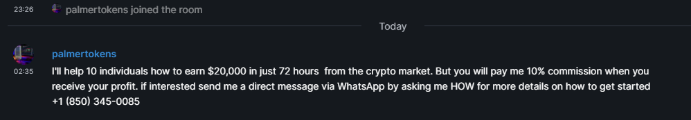

# Anti-spam Community Defense Efforts
Using patterns identified from belligerent spamming campaigns message contents, a strategic defensive deployment for automated combatant operations in real-time communication interoperable ecosystems.
---

**This project is in the beginning stages - the structure and formatting will change, etc**  

## Example
- Starting with the most current investment crypto scammer
- When contributing please include a screenshot, mxid, and the text version of the message, (if you can, please copy and paste the timelines event source)



```json
"content": {
    "body": "I'll help 10 individuals how to earn $20,000 in just 72 hours  from the crypto market. But you will pay me 10% commission when you receive your profit. if interested send me a direct message via WhatsApp by asking me HOW for more details on how to get started\n+1 (850) 345-0085",
    "msgtype": "m.text"
  }
  ```